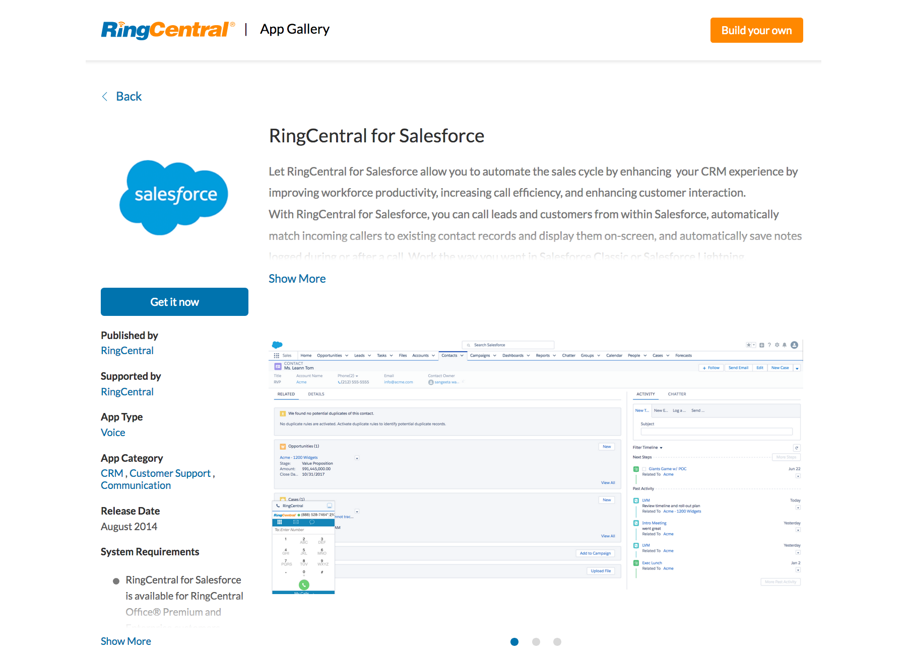
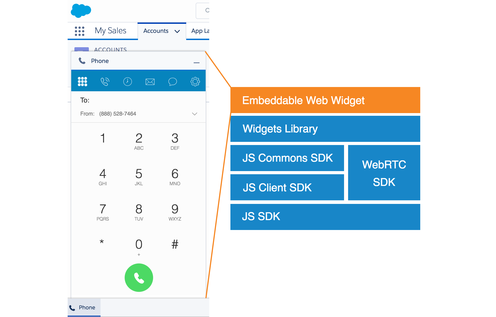

## Add CTI in 15 Minutes with the RingCentral Web Widget

John Wang


Note: I'm John Wang, Sr. Director of Platform for RingCentral and we are going to talk about how to add CTI quickly to your apps in just 15 Minutes with the Web Widget and why this is important.

---

# Why CTI?

Note:

* Problem - Organizational Drag
  * Context Switching
  * Inadequate Information
  * Slow Response Time 

* The Solution - CTI
  * Better Customer Experience
  * Improved Employee Productivity & Efficiency
  * Boosts ROI of CRM
  * Connects with many systems
  * Installs easy in a short timeframe

Our top use case at RingCentral

---

## Our Most Popular Use Case



Note: To get started, how many of you know what Computer-Telephony Integration is? ... It's actually our most popular use case for integrations and embeds a RingCentral web phone into your web app for receiving and making calls with rich integration like click-to-dial and inbound screen-pop, both of which we'll talk about today.

---

## Agenda

* What is the Web Widget?
* Lab #1 - Static HTML
* Lab #2 - Salesforce Open CTI
* Lab #3 - Salesforce + Google

---

## RingCentral and Salesforce Open CTI


Note: 

What is the web widget?

* Out of the box widget you can embed right aways
* Set of UI Components

Before you only had REST APIs and had to build the UI yourself.

---

## Web Widget Capabilities

* WebRTC
* SMS
* Click-to-Dial
* Inbound Screen Pop
* Call Logging

---

## Web Widget Stack



Note:

The widget you see is actually a number of open source libraries that work together. The entire web widget is an impleentation of the widget library.

---

## Web Widgets Library


---

## Web Widget Stack Libraries

* Web Widget Demo: [github.com/ringcentral/ringcentral-widget-demo](https://github.com/ringcentral/ringcentral-widget-demo)
* Widgets Library: [github.com/ringcentral/ringcentral-js-widget](https://github.com/ringcentral/ringcentral-js-widget)
* JS Commons SDK: [github.com/ringcentral/ringcentral-js-integration-commons](https://github.com/ringcentral/ringcentral-js-integration-commons)
* JS Client SDK: [github.com/ringcentral/ringcentral-js-client](https://github.com/ringcentral/ringcentral-js-client)
* WebRTC SDK: [github.com/ringcentral/ringcentral-web-phone](https://github.com/ringcentral/ringcentral-web-phone)
* JS SDK: [github.com/ringcentral/ringcentral-js](https://github.com/ringcentral/ringcentral-js)

Note: Here's a list of the web widget and supporting libraries you can use. At RingCentral, we support open source and all of these are open source.

---

## Lab #1: Static HTML Demo

* Install widget on static HTML webpage
* Configure click-to-dial

---

## Static HTML App Configuration

* Permissions: VoIP Calling, SMS, Read Accounts, Edit Messages, etc.
* OAuth Grants: Authorization Code
* App Type: Browser-based

---

## Add the Web Widget

Add the RingCentral webphone simply by adding `adapter.js` to web page


```html
<a href="tel:+16505550100">(650) 555-0100</a>
<a href="sms:+16505550101">(650) 555-0101</a>

<script>
    (function() {
      var rcs = document.createElement("script");
      rcs.src = "https://embbnux.github.io/ringcentral-widget-demo/adapter.js";
      var rcs0 = document.getElementsByTagName("script")[0];
      rcs0.parentNode.insertBefore(rcs, rcs0);
    })();
</script>
```

---

## Lab #2: Salesforce Open CTI Demo

* Create / Configure Salesforce
* Make and Receive Calls
* Enable Click-to-Dial
* Enable Inbound Screen-Pop
* Enable Call-Logging

---

## CTI Architecture Overview


---

### Lab Prerequisites

* Accounts
  * RingCentral: Office or Developer
  * Salesforce: Dev Edition, Pro or above
* App Configuration
  * Permissions: VoIP Calling, SMS, Read Accounts, Edit Messages, etc.
  * OAuth Grants: Authorization Code
  * App Type: Browser-based

---

### Integration Components

* Salesforce Call Center
* Visualforce Page
* Apex Helper Class

---

### What is a Salesforce Call Center?

* A Salesfore Call Center is used to connect a CTI (computer-telephony integration)
* Users must be assigned to a call center to use a CTI such as RingCentral Web Widget

---

### Creating the Call Center

* Create a Call Center by importing `salesforce_CallCenterDefinition.xml`
* This uses the `/apex/RCPhone` CTI Adapter URL

```xml
<callCenter>
  <section sortOrder="0" name="reqGeneralInfo" label="General Information">
    <item sortOrder="0" name="reqInternalName" label="Internal Name">RingCentralAdapterOpenCTI</item>
    <item sortOrder="1" name="reqDisplayName" label="Display Name">RingCentral Call Center Adapter Open CTI</item>
    <item sortOrder="2" name="reqAdapterUrl" label="CTI Adapter URL">/apex/RCPhone</item>
    <item sortOrder="3" name="reqUseApi" label="Use CTI API">true</item>
    <item sortOrder="4" name="reqSoftphoneHeight" label="Softphone Height">550</item>
    <item sortOrder="5" name="reqSoftphoneWidth" label="Softphone Width">300</item>
    <item sortOrder="6" name="reqSalesforceCompatibilityMode" label="Salesforce Compatibility Mode">Lightning</item>
  </section>
</callCenter>
```

[salesforce_CallCenterDefinition.xml](https://github.com/grokify/ringcentral-web-widget-demo/blob/master/salesforce_CallCenterDefinition.xml)

---

## Create the Webphone Visualforce page

Create an a VF page with iframe to the widget named `RCPhone` to make and receive calls.

```html
<apex:page>
    <style>
        .hasMotif {
            margin : 0px;
        }
    </style>
    <apex:iframe src="https://embbnux.github.io/ringcentral-widget-demo/app.html" height="500" width="300" frameborder="false"/>
</apex:page>
```

---

## Creating a SF App

* In Setup, search for "App Manager"
* Create New Lightning App
* Choose Standard Navigation
* Add Utility Bar Item "Open CTI Softphone"
* Select All Items
* Assign to all User Profiles
* Select Test App and open phone

---

### Click-to-Dial VF Page

Add the following to the RCPhone VF page:

```html
<script src="/support/api/40.0/lightning/opencti_min.js"></script>
<script>
   function postMessage(data) {
       document.getElementsByTagName('iframe')[0].contentWindow.postMessage(data, '*');
   }  
   sforce.opencti.enableClickToDial();
   sforce.opencti.onClickToDial({
       listener: function(result) {
           postMessage({
               type: 'rc-adapter-new-call',
               phoneNumber: result.number,
               toCall: true,
           });
           sforce.opencti.setSoftphonePanelVisibility({ visible: true });
       }
   });
</script>
```

Click a phone number to make a call!

---

### Inbound Screen Pop - Part 1 - Apex

* Create an APEX class `RCPhoneHelper`

```cs
global class RCPhoneHelper {

    // Inbound Screen Pop
    webService static Contact searchContact(String phone) {
        List < List < SObject >> l = [FIND: phone IN PHONE FIELDS RETURNING Contact(Id limit 1)];
        if (l.size() > 0 && l[0].size() > 0) {
            return (Contact) l[0][0];
        }
        return null;
    }
}
```

---

### Inbound Screen Pop - Part 2 - JS

* Add the `searchContact(String phone)` method

```html
function receiveMessage(event) {
    if (event.data.type === 'rc-call-ring-notify') {
        sforce.opencti.setSoftphonePanelVisibility({
            visible: true
        });
        var fromNumber = event.data.call.from;
        if (fromNumber[0] === '+') {
            fromNumber = fromNumber.substring(1);
        }

        sforce.opencti.runApex({
            apexClass: 'RCPhoneHelper',
            methodName: 'searchContact',
            methodParams: 'phone=' + fromNumber,
            callback: function(response) {
                if (response.success == true) {
                    var contactId = response.returnValue.runApex.Id;
                    if (contactId !== null) {
                        sforce.opencti.screenPop({
                            type: sforce.opencti.SCREENPOP_TYPE.SOBJECT,
                            params: {
                                recordId: contactId
                            }
                        });
                    }
                }
            }
        });
    }
}
window.addEventListener("message", receiveMessage, false);
```

Call the user to receive an screen-pop!

---

### Call Logging - Part 1 - Apex

```cs
// Call Logging
webService static void logACall(string contactId, Integer duration, String fromNumber, String toNumber) {
    Task t = new Task(
        ActivityDate = date.today(),
        CallDurationInSeconds = duration,
        CallType = 'Inbound',
        Description = 'From: ' + fromNumber + '\nTo: ' + toNumber + '\nDuration: ' + duration + ' seconds',
        Status = 'Completed',
        Subject = 'Call log',
        TaskSubtype = 'Call',
        Type = 'Call',
        WhoId = contactId
    );
    insert t;
}
```

---

### Call Logging - Part 2 - JS

```js
else if (event.data.type === 'rc-call-end-notify') {
    if (event.data.call.startTime !== null) {
        var fromNumber = event.data.call.from;
        if (fromNumber[0] === '+') {
            fromNumber = fromNumber.substring(1);
        }
        sforce.opencti.runApex({
            apexClass: 'RCPhoneHelper',
            methodName: 'searchContact',
            methodParams: 'phone=' + fromNumber,
            callback: function(response) {
                if (response.success == true) {
                    var contactId = response.returnValue.runApex.Id;
                    if (contactId !== null) {
                        sforce.opencti.runApex({
                            apexClass: 'RCPhoneHelper',
                            methodName: 'logACall',
                            methodParams: 'contactId=' + contactId +
                                '&duration=' + Math.round((event.data.call.endTime - event.data.call.startTime) / 1000) +
                                '&fromNumber=' + event.data.call.from +
                                '&toNumber=' + event.data.call.to,
                            callback: function(rr) {
                                console.log(rr);
                            }
                        });
                    }
                }
            }
        });
    }
}
```

Log a call!

---

## Continue the Journey

RingCentral Developers
* Dev Portal: https://developer.ringcentral.com
* Community: https://devcommunity.ringcentral.com
* Twitter: https://twitter/RingCentralDevs
* Github: https://github.com/ringcentral

John Wang
* Twitter: https://twitter.com/grokify
* Github: https://github.com/grokify