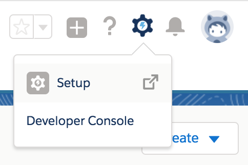
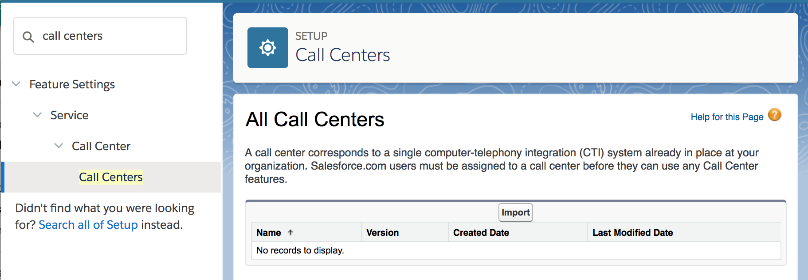
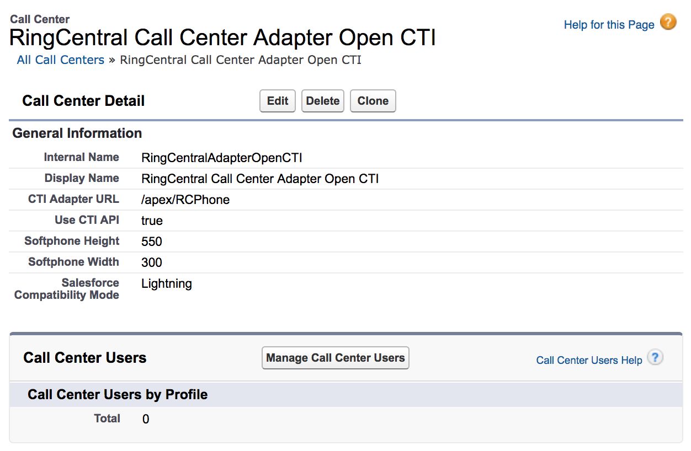
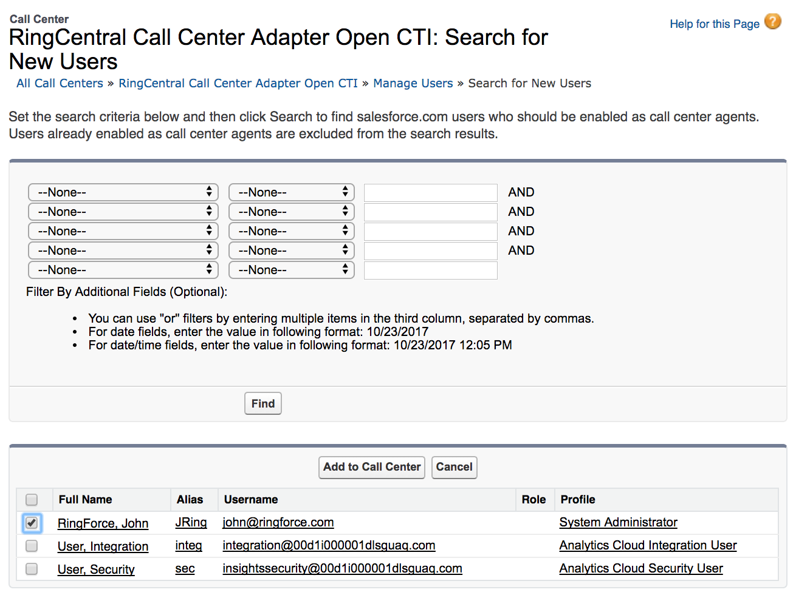
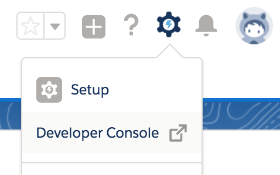
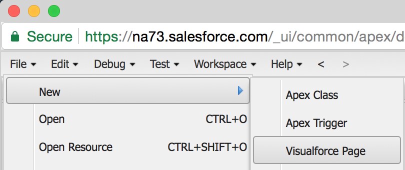
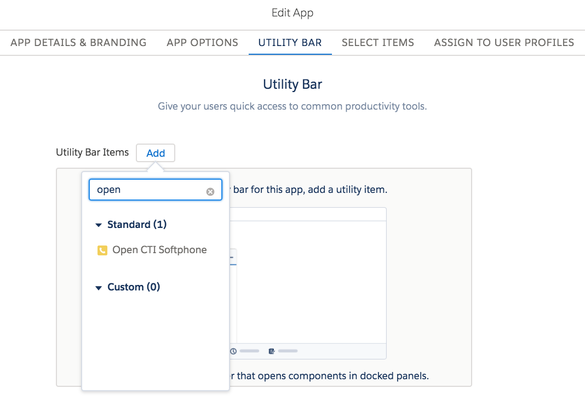
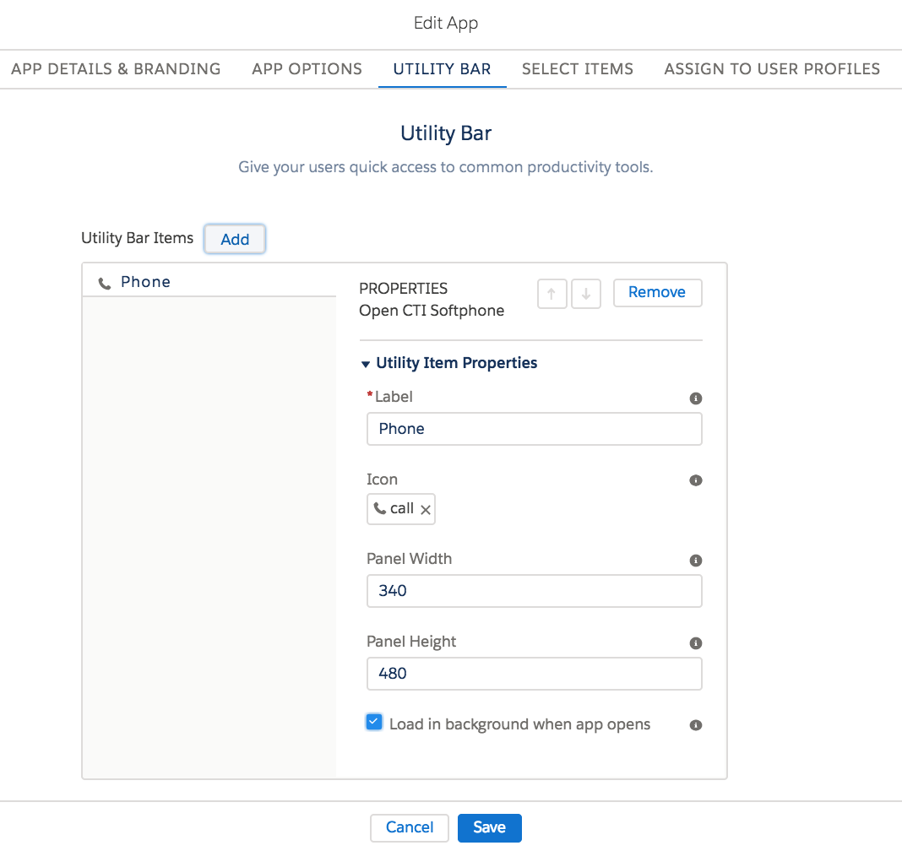

The RingCentral Web Widget demo for Salesforce Lightning is a simple demo that show cases the following use cases:

* Click-to-Dial
* Inbound Screen-Pop
* Call Logging

This demo is located in the [`salesforce_lightning`](github.com/ringcentral-tutorials/ringcentral-web-widget-demos/tree/master/salesforce_lightning) folder.

Note: There is a follow-on demo that builds on this and will create additional screen-pops for Google Search and LinkedIn Search in the [`salesforce_lightning_plus`](github.com/ringcentral-tutorials/ringcentral-web-widget-demos/tree/master/salesforce_lightning_plus) folder. This consists of just one additional line of JavaScript for each serach.

## Contents

* [Installation](#installation)
  * [Create a RingCentral App](#create-a-ringcentral-app)
  * [Clone the repo](#clone-the-repo)
  * [Add the Widget to Salesforce](#add-the-widget-to-salesforce)
    * [Create the Salesforce Call Center](#create-the-salesforce-call-center)
    * [Create the Widget Visualforce Page](#create-the-widget-visualforce-page)
    * [Add the Widget to Your Salesforce App](#add-the-widget-to-your-salesforce-app)
* Integrations
  * Click-to-Dial
  * Inbound Screen-Pop
  * Autoamtic Call Logging

## Installation

To install this demo, clone the repo and load the file in your browser:

### Create a RingCentral App

Create an app with the following characteristics:

| Property | Setting |
|----------|---------|
| Platform Type | Browser-based |
| Grant Types | Authorization Code or Implicit Grant |
| Permissions | see [ringcentral/ringcentral-web-widget](https://github.com/ringcentral/ringcentral-web-widget) | 

### Clone the repo

`git clone https://github.com/ringcentral-tutorials/ringcentral-web-widget-demos`

### Add the Web Widget to Salesforce

To add the RingCentral Web Widget, we need to create a Salesforce Call Center with the Visualforce page and then add users that want to use the Web Widget to the Call Center.

#### Create the Salesforce Call Center

In Salesforce Lightning create a Salesforce Call Center using the following steps:

1. In Salesforce Lightning click `Setup`



2. In the *Quick Find*, type `call centers` and then click **Call Centers**.

3. If you see a "Say Hello to Salesforce Call Center" introduction page, click **Continue**.

4. Then click the **Import** button and select the XML file.



You can create a file similar to the below or import the `salesforce_demo-1.0.0_config_CallCenterDefinition.xml` file.

You can change the settings in the XML file. The following are of note:

* The *Display Name* is set to "RingCentral Call Center Adapter Open CTI"
* The *CTI Adapter URL* is set to `/apex/RCPhone`

```xml
<callCenter>
  <section sortOrder="0" name="reqGeneralInfo" label="General Information">
    <item sortOrder="0" name="reqInternalName" label="Internal Name">RingCentralAdapterOpenCTI</item>
    <item sortOrder="1" name="reqDisplayName" label="Display Name">RingCentral Call Center Adapter Open CTI</item>
    <item sortOrder="2" name="reqAdapterUrl" label="CTI Adapter URL">/apex/RCPhone</item>
    <item sortOrder="3" name="reqUseApi" label="Use CTI API">true</item>
    <item sortOrder="4" name="reqSoftphoneHeight" label="Softphone Height">550</item>
    <item sortOrder="5" name="reqSoftphoneWidth" label="Softphone Width">300</item>
    <item sortOrder="6" name="reqSalesforceCompatibilityMode" label="Salesforce Compatibility Mode">Lightning</item>
  </section>
</callCenter>
```

5. After you have created the Call Center, click **Manage Call Center Users** and then click **Add More Users**.



6. Use the **Find** button to select the users you wish to use the RingCentral Widget, select the users and then click **Add to Call Center**



#### Create the Widget Visualforce Page


<apex:page>
    <style>
        .hasMotif {
        margin : 0px;
        }
    </style>
    <apex:iframe src="https://ringcentral.github.io/ringcentral-web-widget/app.html" height="500" width="300" frameborder="false"/>
</apex:page>

#### Create the Widget Visualforce Page

8. Open the *Developer Console* by clicking the gear icon in the upper right corner.



9. Create a new Visualforce page by clicking **File > New > Visualforce Page**



10. Replace the content of the page with the following HTML. Save the page by clicking **File > Save**

```html
<apex:page>
    <style>
        .hasMotif {
        margin : 0px;
        }
    </style>
    <apex:iframe src="https://ringcentral.github.io/ringcentral-web-widget/app.html" height="500" width="300" frameborder="false"/>
</apex:page>
```

#### Add the Widget to Your Salesforce App

11. Go to the App Manager

In the *Setup > Quick Find*, search for and click on **App Manager**

Select the "Lighting" app you wish to add the Webphone too by clicking **Edit**. For example, you can select the "LightningSales" app as shown below, another Lightning app or click **New Lightning App**.


12. Add Open CTI Softphone

Under the *Utility Bar*, click **Add** and then search for, and click, **Open CTI Softphone**. 



13. You do not need to change any options. Click **Save**.



10. Go to your Salesforce app via the *App Launcher* and bring up the RingCentral Web Widget


## Notes

### Click-to-Dial and Click-to-Text


### Inbound Screen-Pop

**Apex class**

Create the `RCPhoneHelper` Apex class if you don't already have one and add a `searchContact` method as shown below:

```apex
global class RCPhoneHelper {

    // Inbound Screen Pop
    webService static Contact searchContact(String phone) {
        List < List < SObject >> l = [FIND: phone IN PHONE FIELDS RETURNING Contact(Id limit 1)];
        if (l.size() > 0 && l[0].size() > 0) {
            return (Contact) l[0][0];
        }
        return null;
    }
}
```

**Visualforce page**

In your Visualforce page, create a `receiveMessage` function to respond to the `rc-call-ring-notify` event and register it using `window.addEventListener` as shown below. If you are listening to multiple RingCentral event types such as `rc-call-end-notify` as shown for the Call Log use case shown below, you can use an else if clause in the `receiveMessage` function.

```javascript
function receiveMessage(event) {
    if (event.data.type === 'rc-call-ring-notify') {
        sforce.opencti.setSoftphonePanelVisibility({
            visible: true
        });
        var fromNumberE164 = event.data.call.from;
        var fromNumber = phoneUtils.formatNational(fromNumberE164, "us");
        if (fromNumber[0] === '+') {
            fromNumber = fromNumber.substring(1);
        }

        sforce.opencti.runApex({
            apexClass: 'RCPhoneHelper',
            methodName: 'searchContact',
            methodParams: 'phone=' + fromNumber,
            callback: function(response) {
                if (response.success == true) {
                    var contactId = response.returnValue.runApex.Id;
                    if (contactId !== null) {
                        sforce.opencti.screenPop({
                            type: sforce.opencti.SCREENPOP_TYPE.SOBJECT,
                            params: {
                                recordId: contactId
                            }
                        });
                    }
                }
            }
        });
    }
}
window.addEventListener("message", receiveMessage, false);
```