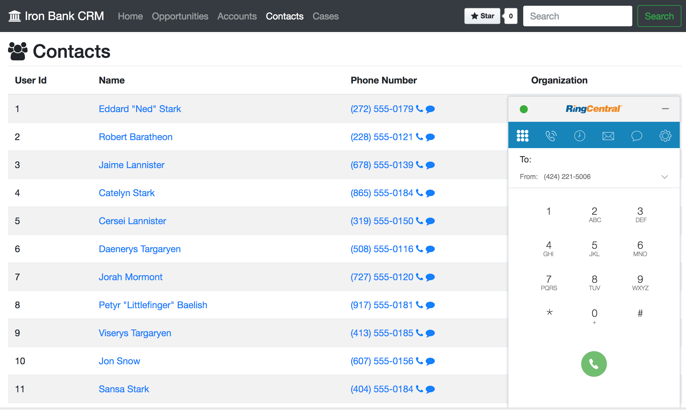

# Static CRM Web Widget Demo

The Static CRM Web Widget demo is a simple demo that show cases a generic CRM with the following use cases:

* Click-to-Dial
* Click-to-Text (SMS)
* Inbound Screen-Pop

This demo is located in the `static_crm` folder.



## Installation and Customization

To install this demo, clone the repo and load the file in your browser:

1. Clone the repo

`git clone https://github.com/ringcentral-tutorials/ringcentral-web-widget-demos`

2. Add your demo PSTN number

Edit the `data/characters_data.js` file for Jon Snow with your PSTN number in E.164 format.

3. Add/remote the demo code

At the bottom of the `./static_crm/index.html` file, either link or copy and paste in the file in `./static_crm/ringcentral.js`, e.g.

`<script src="./ringcentral.js"></script>`

## Notes

### Click-to-Dial and Click-to-Text

These to capabilities are added automatically to the pages since the links are already provided using the `tel` and `sms` URI schemes.

For example:

`<a href="tel:+16505550100">Call</a> <a href="tel:+16505550100">Text</a>`

### Inbound Screen-Pop

This is performed with the following code in `./ringcentral.js`. The code retrieves the from phone number in E.164 format using `data.call.from`. It then uses the `number2id` function to retrieve a userId. If present, the window location is changed to that user and the content for that user is loaded.

```js
(function () {
  window.addEventListener('message', function(e) {
    const data = e.data;
    if (data) {
      switch (data.type) {
        case 'rc-call-ring-notify':
          var id = number2id(data.call.from, number2user);
          if (id) {
            var contact = id2user[id];
            window.title = contact.character.displayName;
            window.history.pushState("", contact.character.displayName, "?id="+id);
            loadSingleUser(id, id2user);
          }
          break;
        default:
          break;
      }
    }
  })
})();
```
